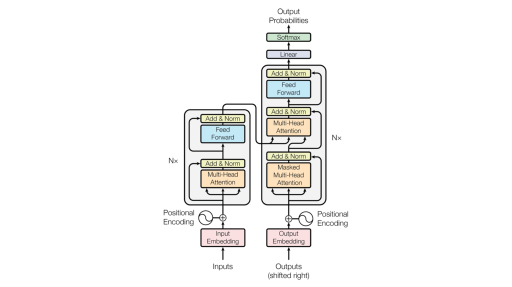

## Transformer
It's implementation of Transformer in [Attention is all you need](https://arxiv.org/abs/1706.03762).
after 10 epoch receive BLUE score of 35.08

## Requirement
* python 3.5+
* pytorch 1.5

## How to understand **Transformer**

Before dive into transformer, I recommend you to watch [Illustrated Guide to Transformers Neural Network: A step by step explanation](https://www.youtube.com/watch?v=4Bdc55j80l8), the best explanation that I found in the Internet.

1. attention
2. mask (source and target)
3. encoder
4. decoder
5. inference

## Reference
1. [Transformers from scratch](http://peterbloem.nl/blog/transformers)
2. [作って理解する Transformer / Attention](https://qiita.com/halhorn/items/c91497522be27bde17ce)
3. [Transformerのデータの流れを追ってみる](https://qiita.com/FuwaraMiyasaki/items/239f3528053889847825)